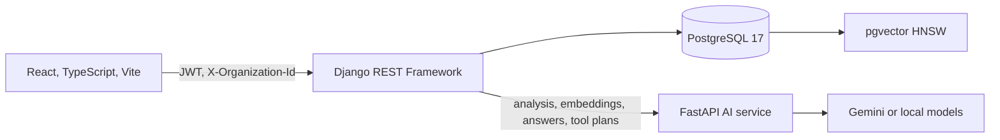

# Flowdesk AI

AI-powered product operations platform

Flowdesk is a workspace for support and product teams: customers, tickets, internal knowledge, and an operations agent in one place. The AI classifies tickets, answers from the knowledge base with sources, and chooses tools such as search, create, and update. It does not own the database.

The model proposes a classification or a tool call. Django checks the workspace, the role, and the payload, then stores the result. Sensitive writes stay pending until a person approves them.

## 1. Why Flowdesk?

Support work is split across tickets, customer records, and internal docs. A chat window on top of that data is not an operations tool: the model can invent a ticket key, skip a permission, or write a row nobody asked for.

Flowdesk keeps those workflows in the application and adds AI only where the result has a fixed shape.

**LLMs propose. The application validates. Humans approve sensitive actions.**

That line matches the code. FastAPI returns a plan or a structured analysis. Django executes reads, rejects invalid writes, and, by default, holds a valid write as a pending `AgentAction` until the same user approves it. An admin can turn that approval step off. Authorization still stays in Django.

## 2. Key Features

### AI ticket analysis

`POST /v1/analyses/tickets` returns a fixed object: category (`bug`, `feature_request`, `billing`, `general_inquiry`), suggested priority, summary, sentiment, suggested tags, and a confidence score. Django stores it as an `AIAnalysis` row. Suggested priority does not change the ticket.

Automatic analysis is off until an admin enables it. Anyone can still run Analyze ticket. If the model fails, the ticket remains and the analysis is marked failed. With no API key, a local keyword classifier (`flowdesk-local`) fills the same schema.

### RAG knowledge base

A source can be pasted text, a `.txt`, `.md`, `.pdf`, or `.docx` upload (8 MB), or a public `http`/`https` URL. Private and loopback addresses are rejected. Django extracts the text, splits it into overlapping chunks (about 700 characters, 100-character overlap, at most 80 chunks), and stores a 128-dimension embedding on each chunk.

PostgreSQL keeps the same vector in a `pgvector` column with an HNSW index (`vector_cosine_ops`). A question is embedded, the nearest chunks for that workspace and embedding model are loaded (up to 30), then re-ranked in Django: `0.35` cosine similarity and `0.65` lexical overlap. The top four chunks above `0.15` relevance are sent to the answer step. The API returns the answer and the source titles. If the sources are too weak, the answer says the knowledge base does not contain enough information.

### AI operations agent

`POST /v1/agent/plan` may choose only these tools:

| Tool | What Django does |
| --- | --- |
| `search_tickets` | Read. Runs immediately. |
| `get_customer` | Read. Runs immediately. |
| `search_knowledge_base` | Read. Runs immediately. |
| `create_ticket` | Write. Validated, then held for approval by default. |
| `update_ticket` | Write. Same gate. |
| `add_ticket_comment` | Write. Same gate. |

Unknown tools are ignored. At most four calls run per turn. When a tool returns data, Django writes the reply from that data, including ticket links such as `[FD-1284](/tickets/<uuid>)`. The model does not invent the ticket id.

Conversations are stored per user and workspace. The planner itself only receives the latest assistant reply, capped at 500 characters.

### Human-in-the-loop

A valid write becomes a pending `AgentAction` for the signed-in user. Approve runs the same ticket and comment serializers as the REST API and writes an activity log with the human as the actor. Cancel stores no ticket change. Viewers can ask questions. Applying a change requires an agent role. Another user or workspace cannot approve the action.

Workspace setting `require_agent_approval` defaults to true. If an admin turns it off, a valid write runs immediately after the same validation.

### Multi-tenancy and authorization

Every domain row belongs to an organization. The client sends a JWT and `X-Organization-Id`. Membership roles rank from viewer to agent, admin, and owner. Viewers read. Agents write. Admins delete and change AI settings. Access tokens last 30 minutes. Refresh tokens rotate for 7 days.

## 3. Architecture



FastAPI does not write application tables. Django calls it and decides what is stored. Redis is started by Compose and is not read by application code.

In production, nginx serves the built frontend and proxies `/api`, `/admin`, and `/static` to Django, so the browser uses one origin. In development, Vite proxies the API to Django.

### Frontend

React 18, TypeScript, and Vite. Styled Components for the UI. React Query for server state. The app covers sign-in, a workspace shell, dashboard, tickets, customers, knowledge, the agent, and settings. Ticket search lives on the tickets page.

### Django API

Django owns authentication, workspace membership, business rules, and persistence: organizations, customers, tickets, comments, tags, knowledge documents and chunks, analyses, agent conversations, and agent actions. Serializers and role checks run before a write. Request logs include a request id, method, path, status, and duration. `/api/v1/health/` checks the process. `/api/v1/ready/` checks PostgreSQL.

### FastAPI AI service

The AI service exposes ticket analysis, embeddings, grounded answers, and agent planning. Each endpoint returns a structured result. `/health` and `/ready` are used as container checks in production.

### PostgreSQL and pgvector

Relational data lives in PostgreSQL 17. Knowledge chunk embeddings are also stored as `vector(128)` so retrieval can use an HNSW cosine index. A JSON copy of the embedding stays on the chunk for the hybrid re-rank.

### AI models

With `GEMINI_API_KEY` set, analysis and planning call Gemini (`generateContent` with a JSON schema). Embeddings call `gemini-embedding-001` at 128 dimensions. The default chat model is `gemma-4-26b-a4b-it`. Admins can also select `gemini-3.6-flash` for ticket analysis. That dropdown does not change the agent planner, which uses `GEMINI_MODEL`.

With an empty key, analysis uses keyword rules, embeddings use a deterministic hashed bag-of-tokens vector, answers are extractive, and the agent uses a rule planner (`flowdesk-local-agent`). If a Gemini plan or embedding call fails, those paths fall back to the local implementation. Ticket analysis does not: a Gemini failure is stored as a failed analysis.

## 4. AI architecture

### Ticket analysis pipeline

```text
Ticket title, description, customer
        →  Django
        →  FastAPI  POST /v1/analyses/tickets
        →  JSON schema (category, priority, summary, sentiment, tags, confidence)
        →  Pydantic validation
        →  AIAnalysis row
        →  Ticket page
```

Structured output keeps the model inside an enum and a schema. Django can store the row, render it, and count it on the dashboard without parsing free text. The ticket's own priority, status, assignee, and tags stay under the user.

### RAG pipeline

```text
Document or URL
        →  text extraction, private-URL rejection
        →  chunking
        →  128-d embedding (Gemini or local)
        →  PostgreSQL + pgvector HNSW
        →  cosine candidate search, scoped to the workspace
        →  hybrid rank (0.35 cosine, 0.65 lexical overlap)
        →  answer from those chunks only
        →  answer + sources
```

The answer prompt tells the model to use only the retrieved excerpts and to say when they are not enough. Seeded documents can be indexed with the local embedding so the database can start before the AI service is listening.

### Agent and tool-calling pipeline

```text
User message
        →  Django  (length check, workspace, role)
        →  FastAPI  POST /v1/agent/plan
        →  tool name + arguments, limited to the six tools
        →  Django executes reads immediately
        →  Django validates writes
        →  pending AgentAction, unless approval is turned off
        →  Approve or Cancel
        →  ticket serializers, then the database
```

The model never receives a database connection. Ticket keys in the reply come from rows Django already loaded.

## 5. Human-in-the-loop safety model

```text
LLM
  ↓
Proposed tool call
  ↓
Django validation and role check
  ↓
Pending AgentAction
  ↓
Human approval when require_agent_approval is on
  ↓
Same serializers as the REST API
  ↓
Database and activity log
```

This split is what makes the agent usable in an interview discussion:

- The model cannot insert or update rows on its own.
- Permission checks stay in Django, next to the rest of the API.
- A write has an actor, a tool name, arguments, a status, and a result.
- Approve and cancel are explicit. Cancel does not change the ticket.
- Reads still do not wait. Search and lookup return immediately, built from the database.

Approval is the default, not a hard-coded law. The workspace flag exists so an admin can let validated writes run immediately. Invalid writes are explained and are not stored as pending actions.

## 6. Engineering highlights

- Split inference from authority: FastAPI returns structured results, Django persists them.
- Ticket analysis uses a JSON schema and Pydantic models, with a local classifier when no API key is set.
- Knowledge ingestion covers text, PDF, Word, and public URLs, with chunking and a checksum so the same content is not indexed twice.
- Retrieval uses pgvector HNSW for candidates and a hybrid cosine plus lexical rank for the final four chunks.
- The agent planner is constrained to six tools. Django runs the plan and writes replies from tool results.
- Writes go through a pending `AgentAction`, the existing serializers, and an activity log.
- Organizations isolate data. Roles gate reads, writes, deletes, and AI settings. JWTs rotate.
- Development and production Compose projects are separate. Production refuses a debug flag, a wildcard host list, or a short or placeholder secret.
- Health and readiness checks, request ids, and GitHub Actions cover the Django suite, the AI-service tests, the frontend, and a PostgreSQL migration job.

## 7. Tech stack

**Frontend**

- React 18
- TypeScript
- Vite
- Styled Components
- TanStack Query

**Backend**

- Django
- Django REST Framework
- SimpleJWT
- drf-spectacular
- FastAPI
- Pydantic

**AI**

- Gemini structured output (`responseJsonSchema`)
- Tool planning
- RAG over retrieved chunks
- Embeddings (`gemini-embedding-001`, 128 dimensions)
- Local fallbacks for classification, embeddings, answers, and planning

**Database**

- PostgreSQL 17
- pgvector
- HNSW (`vector_cosine_ops`)

**Infrastructure**

- Docker and Docker Compose
- nginx
- Gunicorn
- Uvicorn
- GitHub Actions

**Security**

- JWT access and rotating refresh tokens
- Organization tenancy
- Role checks (viewer, agent, admin, owner)
- Human approval for agent writes, on by default

Redis is in both Compose files. Application code does not use it.

## 8. Screenshots / Demo

The repository does not include a curated screenshot set. `frontend/scripts/audit-*.png` are UI audit captures, and several are blank or show an older shell, so they are not used here.

Replace each placeholder with a current capture:

### Dashboard

[image]

### AI ticket analysis

[image]

Open FD-1284. The seeded ticket already has a stored analysis.

### Knowledge base / RAG

[image]

Ask how a customer should export a dataset over 50,000 rows, and show the cited source.

### AI agent

[image]

Ask `Find unresolved export bugs`. Ticket keys in the reply should be links.

### Human approval workflow

[image]

Ask for a ticket change and show the pending action before Approve. A second capture of Cancel is worth including, because nothing is written.

**TODO:** add those five images under something like `docs/screenshots/` and drop the placeholders. The audit PNGs should not be published as the demo.

## 9. Quick start

You need Docker Desktop with Docker Compose. The first start builds images, migrates, and loads the demo workspace. Later starts reuse that database.

```bash
git clone https://github.com/koryun2/Flowdesk-AI.git
cd Flowdesk-AI
cp .env.example .env
docker compose up --build
```

PowerShell:

```powershell
git clone https://github.com/koryun2/Flowdesk-AI.git
cd Flowdesk-AI
Copy-Item .env.example .env
docker compose up --build
```

The API is ready when the backend log says the development server is listening on port 8000. Open http://localhost:5173.

Demo login: `koryun@flowdesk.ai` / `flowdesk`, workspace Flowdesk Labs.

| Service | URL |
| --- | --- |
| Web app | http://localhost:5173 |
| Django health | http://localhost:8000/api/v1/health/ |
| Django readiness | http://localhost:8000/api/v1/ready/ |
| API reference | http://localhost:8000/api/v1/docs/ |
| Django admin | http://localhost:8000/admin/ |
| FastAPI health | http://localhost:8001/health |
| FastAPI reference | http://localhost:8001/docs |

Leave `GEMINI_API_KEY` empty to stay on the local models. To use Gemini, set the key in `.env` and recreate the AI container:

```bash
docker compose up -d --no-deps --force-recreate ai-service
```

Compose reads `.env`. A variable already set in the terminal wins. If this terminal was used for the production stack, clear `POSTGRES_PASSWORD` and `DJANGO_SECRET_KEY` first. The development database password is `flowdesk`.

```powershell
Remove-Item Env:POSTGRES_PASSWORD -ErrorAction SilentlyContinue
Remove-Item Env:DJANGO_SECRET_KEY -ErrorAction SilentlyContinue
```

```bash
unset POSTGRES_PASSWORD DJANGO_SECRET_KEY
```

`docker compose down` stops the stack and keeps the database. `docker compose down -v` deletes it. The next start seeds the demo again.

A short walkthrough once you are signed in:

1. Open ticket FD-1284 and read the stored category, summary, and sentiment.
2. On Knowledge, ask how a customer should export a dataset over 50,000 rows and check the cited source.
3. On Agent, ask `Find unresolved export bugs`.
4. Ask for a ticket change, then Cancel. Nothing is written until Approve.

### Production

`compose.prod.yaml` is a separate Compose project (`flowdesk-prod`) with its own database volume. It does not mount source and does not publish PostgreSQL or Redis. Use a different terminal from development.

```bash
export DJANGO_SECRET_KEY="replace-with-your-own-secret-at-least-32-chars"
export POSTGRES_PASSWORD="replace-with-a-database-password"
export SEED_DEMO=true
docker compose -f compose.prod.yaml up --build
```

```powershell
$env:DJANGO_SECRET_KEY = "replace-with-your-own-secret-at-least-32-chars"
$env:POSTGRES_PASSWORD = "replace-with-a-database-password"
$env:SEED_DEMO = "true"
docker compose -f compose.prod.yaml up --build
```

The app is at http://localhost:8080. Leave `SEED_DEMO` unset for an empty database. Set it to `true` only when you want the demo account.

## 10. Configuration

Copy `.env.example` to `.env`. Do not commit `.env` or a real API key.

| Variable | Role |
| --- | --- |
| `DJANGO_SECRET_KEY` | Django secret. Production rejects placeholders and values shorter than 32 characters. |
| `DJANGO_DEBUG` | Development default is true. Production forces false. |
| `DJANGO_ALLOWED_HOSTS` | Host allowlist. Production rejects an empty list or `*`. |
| `POSTGRES_DB`, `POSTGRES_USER`, `POSTGRES_PASSWORD` | Database. Development default password is `flowdesk`. Production requires `POSTGRES_PASSWORD`. |
| `GEMINI_API_KEY` | Optional. Empty keeps the local models. |
| `GEMINI_MODEL` | Chat and agent planner model. Default `gemma-4-26b-a4b-it`. |
| `GEMINI_EMBEDDING_MODEL` | Default `gemini-embedding-001`. |
| `WEB_ORIGIN` | Public origin for the production stack. Default `http://localhost:8080`. |
| `WEB_PORT` | Published nginx port. Default `8080`. |
| `DJANGO_SECURE_COOKIES` | Set `true` behind TLS. |
| `SEED_DEMO` | Production only. `true` loads the demo workspace. |

Workspace AI settings are stored on the organization, not in `.env`: automatic analysis (default off), require agent approval (default on), and the analysis model (`gemma-4-26b-a4b-it` or `gemini-3.6-flash`).

## 11. Production architecture

```text
Browser
   │
   ▼
nginx :8080
   ├──  built React app
   ├──  /api, /admin, /static  →  Gunicorn (Django)
   └──  security headers (nosniff, Referrer-Policy, X-Frame-Options)
                │
                ├──  PostgreSQL 17 + pgvector   (not published)
                └──  Uvicorn (FastAPI)           (not published)
```

Production Compose runs Django under Gunicorn (2 workers) and the AI service under Uvicorn without reload. Images are built, not bind-mounted. Backend and AI containers define health checks against `/api/v1/ready/` and `/ready`. nginx is checked with a local GET. The Django process calls `validate_production_settings` and will not start when debug is on, the secret is a known placeholder or shorter than 32 characters, or `ALLOWED_HOSTS` is empty or `*`.

Behind TLS, set `WEB_ORIGIN` to the public `https` origin, `DJANGO_ALLOWED_HOSTS` to the host name, and `DJANGO_SECURE_COOKIES=true`.

This is a production-oriented layout for a portfolio deployment. It is not a claim that the product is a hosted, operated service.

## 12. API / documentation

- Django OpenAPI UI: http://localhost:8000/api/v1/docs/ and `/api/v1/schema/`
- FastAPI reference: http://localhost:8001/docs
- [flowdesk_ai_documentation.md](flowdesk_ai_documentation.md) — short notes on the same boundaries as this README
- [Flowdesk AI - Product & Technical Blueprint.pdf](<Flowdesk AI - Product & Technical Blueprint.pdf>) — earlier product and technical blueprint

Where the blueprint and the code disagree, the code is the source of truth. In particular, automatic ticket analysis now defaults to off, and the provider is Gemini.

## 13. Project status

**Implemented**

- Workspace auth, registration, and role-based access
- Customers, tickets, comments, tags, and ticket search
- Optional ticket analysis and a manual analyze action
- Knowledge ingestion, pgvector retrieval, hybrid ranking, and source-cited answers
- Agent planning, immediate reads, approval-gated writes, and saved conversations
- Workspace AI settings for analysis, approval, and the analysis model
- Development and production Compose stacks, health checks, and CI

**Present in the UI, not backed by the API**

- Profile, workspace name, password, two-factor authentication, and the integration buttons show a toast and do not persist
- Notifications are a fixed sample list
- The sidebar “AI actions 742 / 1k” meter is static
- The workspace “Reset data” control clears an old browser copy. It does not reset the server

**Intentionally out of the request path**

- Redis is reserved in Compose and unused
- The agent planner does not see the full saved conversation, only the last assistant reply (500 characters)
- Analysis suggestions are not applied to the ticket

## 14. Roadmap

These are the next pieces that would make the product match its screens. They are not built.

- Persist profile, workspace, and security settings, or remove the controls that only toast
- Drive notifications from ticket, analysis, and knowledge events
- Send the planner the relevant conversation, not only the last reply
- Let the workspace model setting apply to the agent planner as well as ticket analysis
- Replace the static usage meter, or wire it to real `AgentAction` counts
- Add the screenshots listed in section 8
